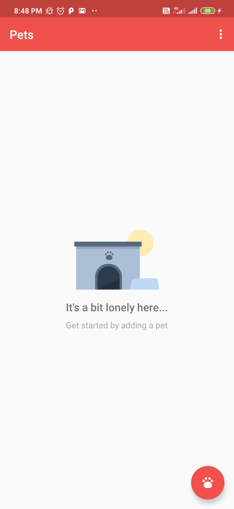
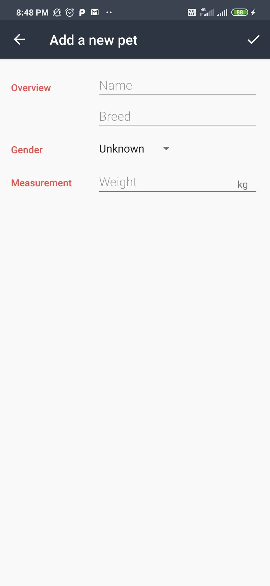
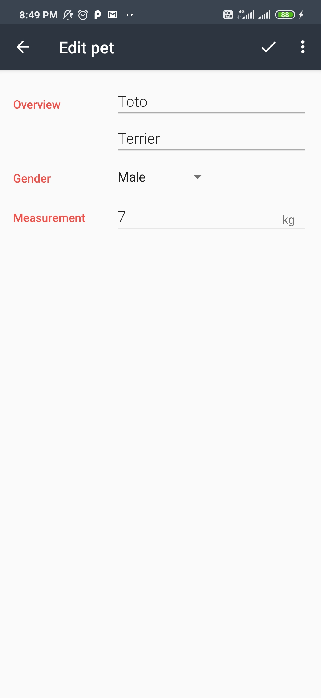
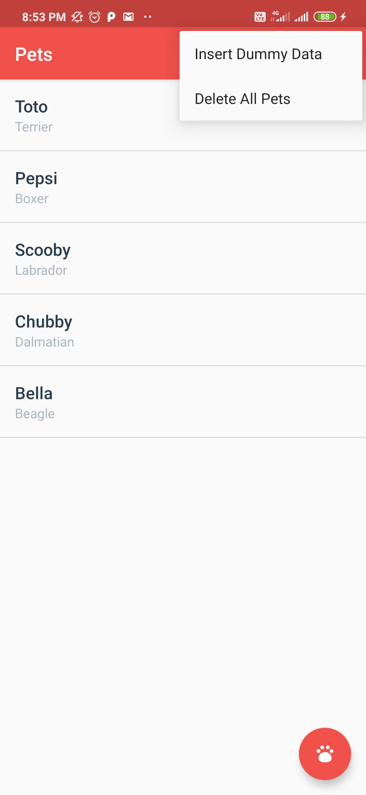

# Udacity-Android-Pets-App
Pets App
===================================

This app displays lists of pets that comes in a shelter home.
Used in a Udacity course in the Beginning Android Nanodegree.

## Screenshots
<table>
<tr>
<td></td>
<td></td>
</tr>
<tr>
<td></td>
<td></td>
</tr>
</table>
